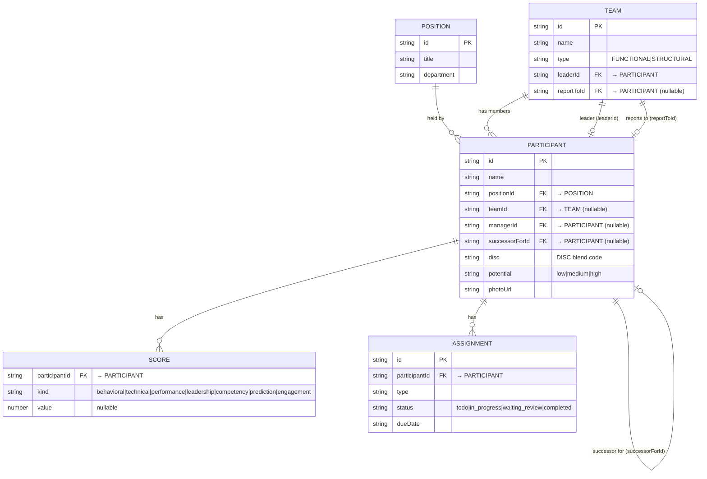

# Canonical Data Model (PGS-1133 / E1)

Sumber of-record: `public/data/participants.csv` + `public/data/assignments.csv`.
Codegen: `npm run seed` → `src/data/model/generated.ts` (jangan edit manual).
Semua modul membaca lewat **selectors** (`src/data/model/selectors.ts`), bukan file mentah.

## ERD



## Constraint (AC-5874) tanpa DB
Karena app frontend-only, FK ditegakkan via:
- **Build time**: `scripts/seed.mjs` validasi referential integrity → gagal (exit 1) kalau ada `managerId/teamId/successorForId/participantId/leaderId/reportToId` yang orphan.
- **Runtime**: `assertReferentialIntegrity()` (`validate.ts`) dipanggil sekali saat store di-load → throw kalau data rusak.

## Extensibility (AC-5840)
- Tambah **field**: tambah kolom CSV + baca di `store.ts`/selector. Consumer lama tak berubah.
- Tambah **entitas**: tambah tipe + array + selector set baru. Interface existing stabil.
- **Scalable**: ganti sumber CSV→API cukup ubah loader `generated`/`store`; index & selector tetap.

## Cara "menjalankan" (AC-5876)
- Data auto-load saat `npm run dev` (generated.ts ikut ter-bundle).
- Setelah mengubah CSV: `npm run seed` (regenerate + validasi). Satu perintah, tanpa konfigurasi manual.

## Consumers (lewat selector)
- `dummyData.ts` → `candidates` (adapter back-compat 11 card).
- `teamsData.ts` → Team Profile.
- `talentMappingData.ts` → Talent Mapping (via `candidates`).
- `managerTeamData.ts` → Home manager mode.
- **Vismap**: belum disatukan (stage lanjutan — butuh skema CAP/heatmap/dev-data). Masih baca `TDP-Vismap-112-Merged.csv`.
```
